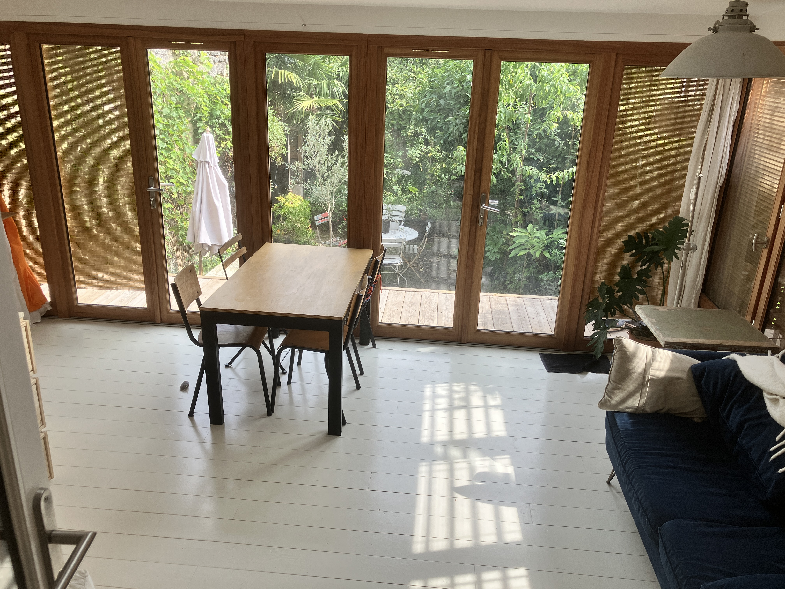
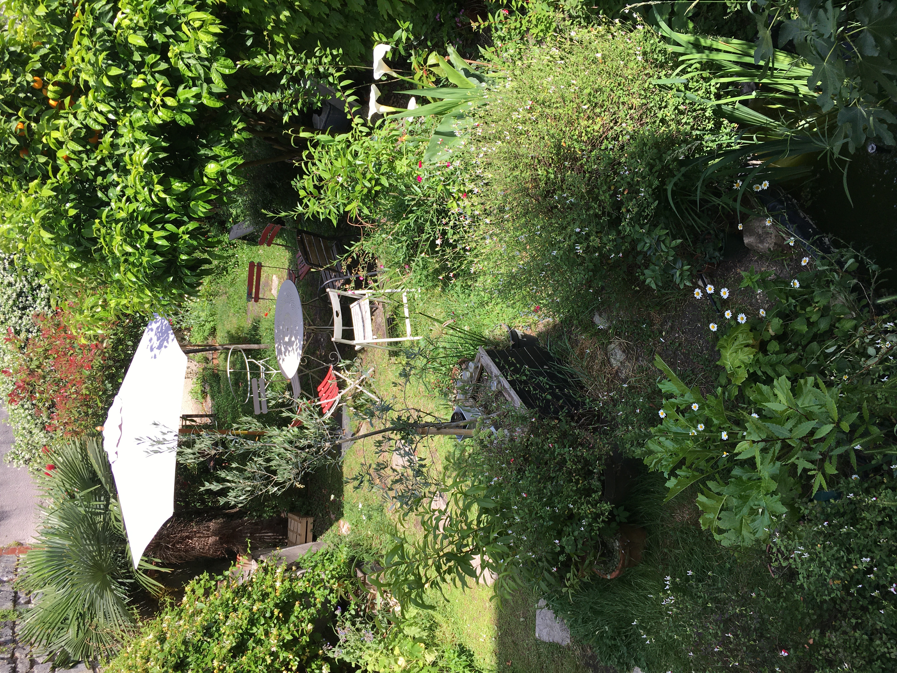
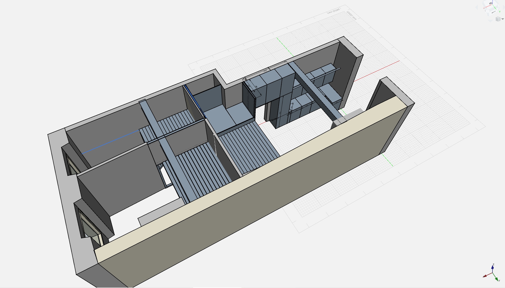

Title: Renovation d'un appartement 
ShortTitle: Renovation d'un appartement 
Category: Projects
Date: '2024-12-01'
Image: cuisine.JPG
tags: design architecture menuiserie
authors: fdy ccl

Ce site présente la documentation des travaux de rénovation et d'extension d'un appartement de 48m2 environ (loi Carez) est situé en rez-de-jardin. Le résultat est un T4 de 67 m2 (Carrez) avec 15m2 de mezzanine en plus.

**[Lien vers le site](./reno_appart/)**

L'objectif globale de cette rénovation est de permettre à une famille avec 2 enfants de pouvoir vivre en harmonie en disposant d'un espace commun fonctionnel et fluide, mais aussi d'espaces privatifs, même de petite taille, permettant de retrouver une intimité.

La rénovation de cet appartement a donc consisté à :  

- Construire une extension à la place de la terrasse du jardin pour agrandir la cuisine et créer un espace repas avec vue sur le jardin.

{: width='100%'}

- Révéler et restaurer des parties de murs en pierre
- Révéler une partie des poutres et solivages en bois
- Agrandire le séjour avec la création d'une mezzanine dans le séjour au dessus de l'ancien emplacement de la cuisine et de la salle de bain 
- Réfection complète et aggrandissement de la salle de bain avec des matériaux plus nobles et en créant une cloison porteuse pour la mezzanine
- Agrandissement de la surface utile de la plus grande chambre:  reconstruction en plus grand de la mezzanine qui s'appuie elle aussi sur une cloison porteuse séparant les 2 chambres; cette chambre sera partagée entre les 2 enfants qui pourront soit dormir ensemble sur la mezzanine aggrandie, soit se partager entre l'espace supérieur et inférieur.
- Optmisation de la hauteur de la mezzanine dans la 2ème chambre: reconstruction de la mezzanine dans les mêmes proportions mais avec un plancher plus fin et placé plus bas. Cette chambre sera utilisée par les parents qui dormiront sur la mezzanine, l'espace inférieur sera lui réagencé en rangements et espaces bureaux

[Lien vers le site](./reno_appart/)

{: width='100%'}

{: width='100%'}
