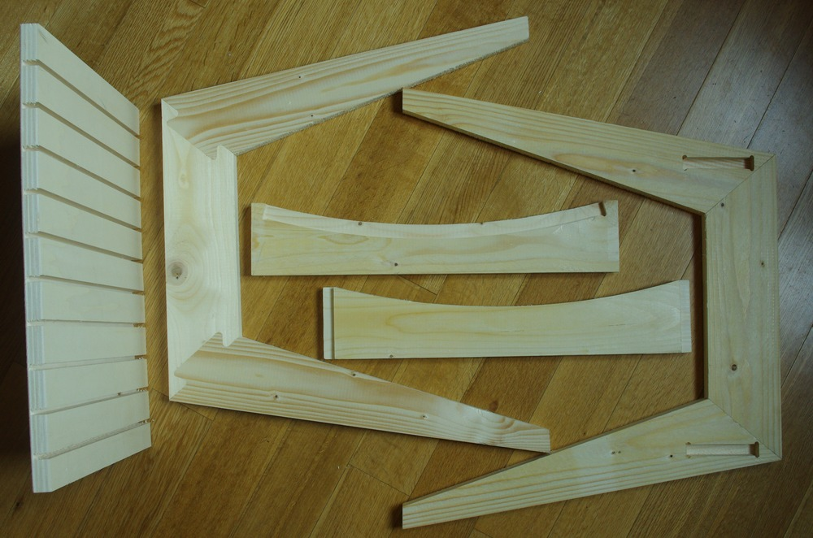

Title: Premier modèle de tabouret usiné à la CNC
ShortTitle: Tabouret 02
Category: Projects
Date: '2017-07-03'
Image: IMGP6823.JPG
tags: fabrication
authors: fdy

<!--{: data-lightbox='tab02'}-->

** Matériau: ** Pin massif pour les piètements et traverses, Contre-Plaqué de bouleau pour l'assise

** Dimensions: **  Haut. x Prof. X Larg. = 450 x 500 X 480 mm

    
Ce tabouret est le premier modèle d'une série à venir de meubles
entièrement usinés avec une fraiseuse CNC. Les 2 piètements sont réalisés par
3 pièces qui s'encastrent par une queue d'aronde (adaptée pour l'usinage
CNC) renforcée par un épaulement de 5mm. Les supports de l'assise sont
joints aux piètements par des tenons-mortaises, eux-aussi adaptés aux
contraintes de l'usinage CNC
<!-- (cf [First steps in CNC milling]({filename}CNC_Milling.md)) -->
 

{: .right width='100%'}

{: .right width='100%'}
