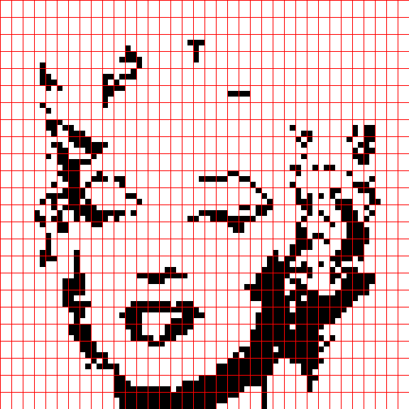
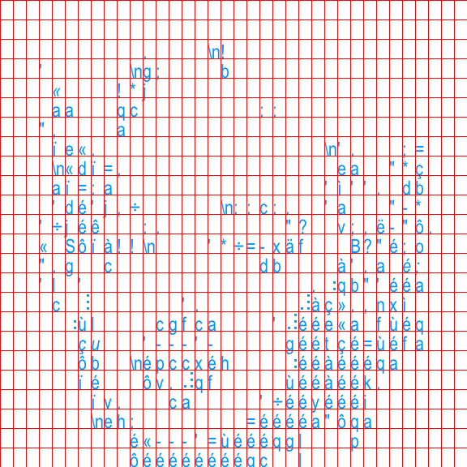
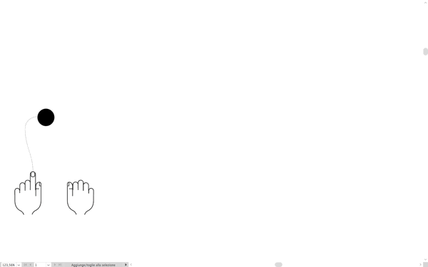

Title: From image to touch
ShortTitle: From image to touch
Category: Projects
Date: '2017-03-01'
Image: tolomeo/MARYLIN.gif
tags: research
authors: ccl

A project about inclusion in collaboration with [Fabio Fornasari](https://fabiofornasari.net/abc/) and the [Tolomeo museum](http://www.cavazza.it/node/1001), the [Francesco Cavazza Institute](http://www.cavazza.it/vedereoltre/2011-2/Sito_borra-eng.html) for Blind People in Bologna, Italy.

<section id="photos">
  
  
  
  
</section>

<!-- images grid -->

