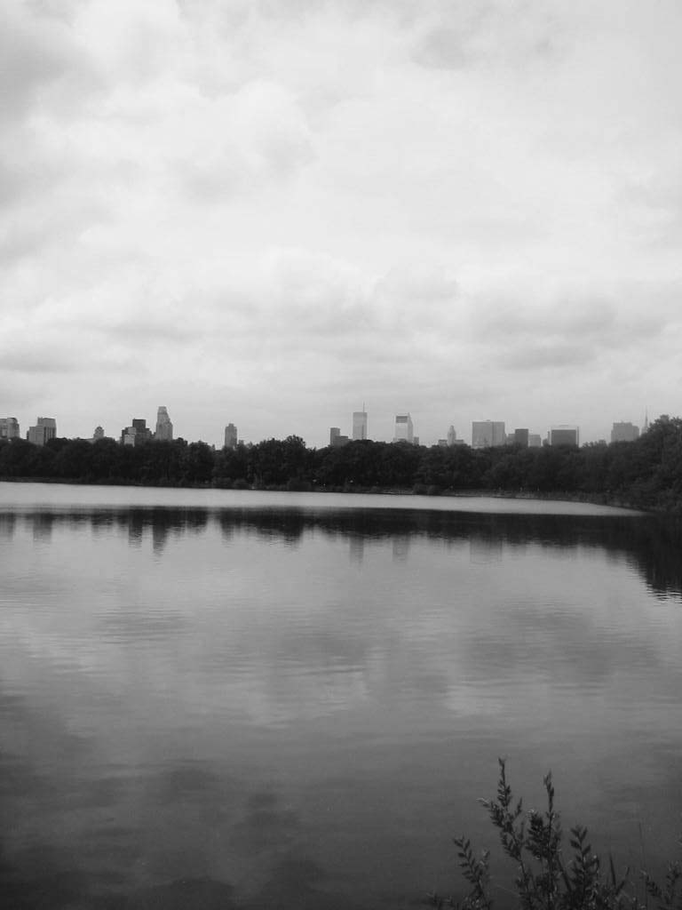
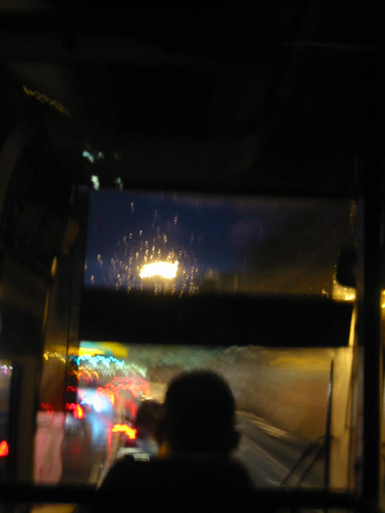
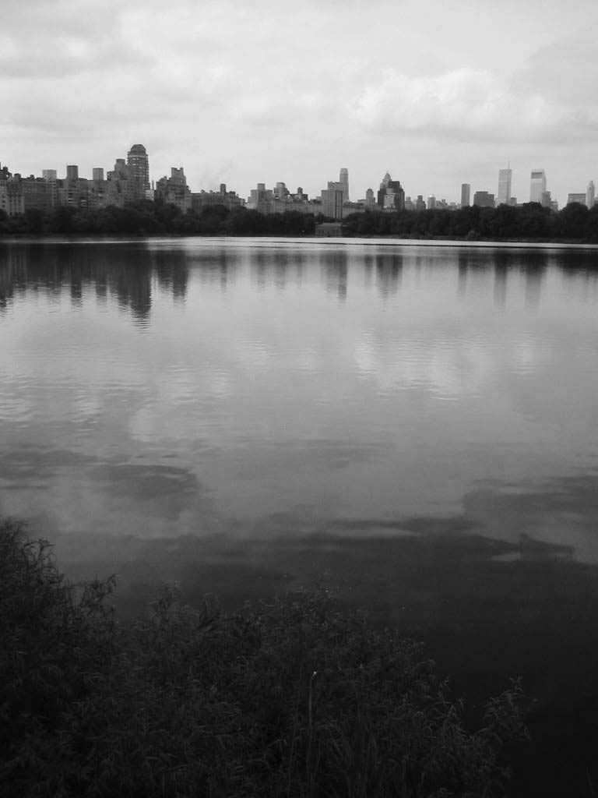
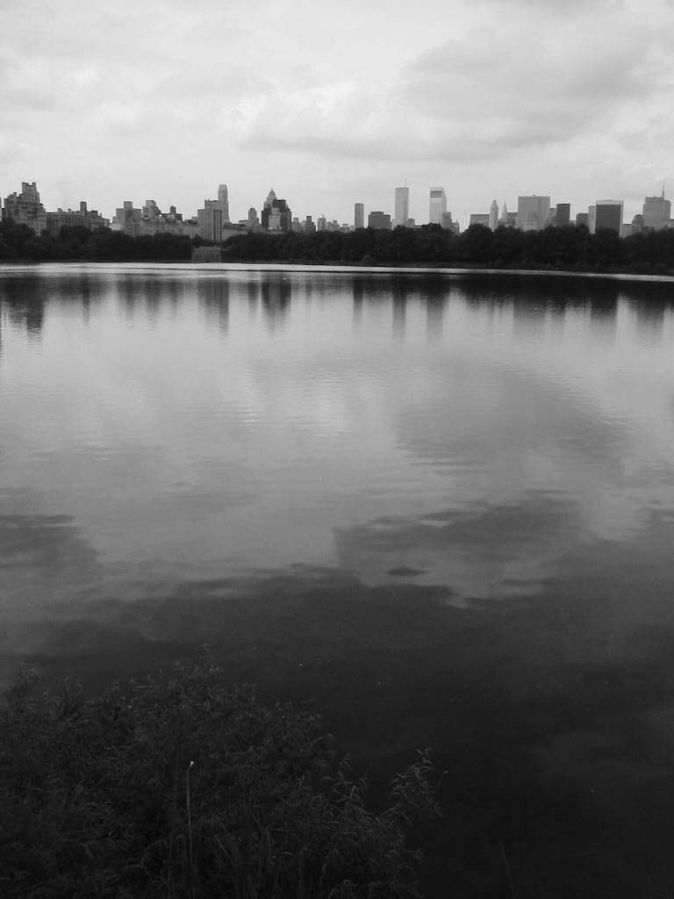

Title: Visual impacts
ShortTitle: visual impacts
Category: Projects
Date: '2009-10-01'
Image: visual_impacts/NY_IMG_0224.jpg
tags: installation
authors: ccl

We are constantly catching reality on the lookout from the slightest detail...
<!--
{:width="100%"}
{:width="100%"}{:width="100%"}{:width="100%"}
-->

<section id="photos">
  
  
  
  
</section>

<!-- images grid -->

