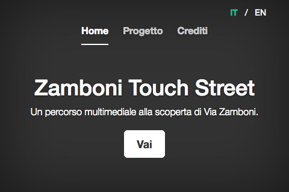
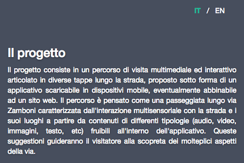
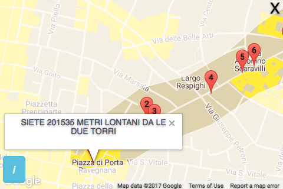

Title: Zamboni Touch Street
Shorttitle: Zamboni Touch Street
Category: Projects
Date: '2017-03-29'
Image: zamboni/1_map_2.png
tags: web
authors: ccl

<!---->

*Zamboni Touch Street* is an app on mobile device that propose an interactive way to discover Zamboni Street in Bologna, Italy. This project is in collaboration with the [Academy of fine arts in Bologna](http://www.ababo.it/ABA/).

<section id="photos">
  
  
  
  
</section>

<!-- images grid -->

